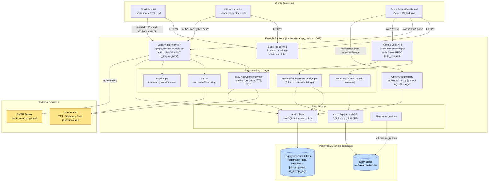
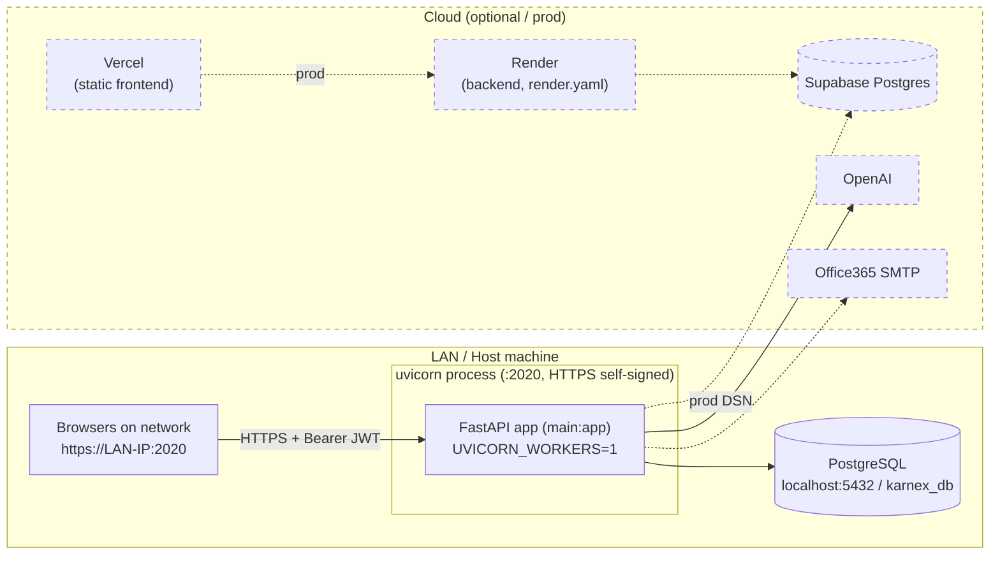
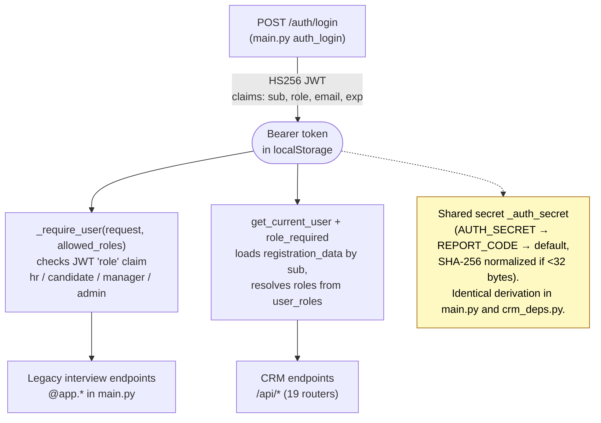
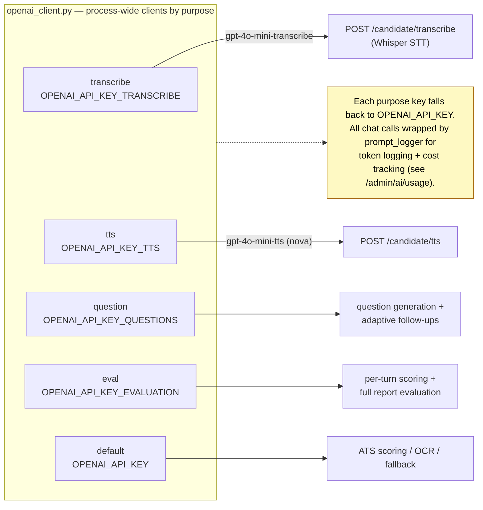

# 1. System Architecture

High-level architecture of the KARNEX AI Interview + CRM platform.

## 1.1 High-level system architecture

## 1.2 Runtime / deployment topology

## 1.3 Authentication realms (one token, two authorizers)

## 1.4 OpenAI purpose-keyed clients

