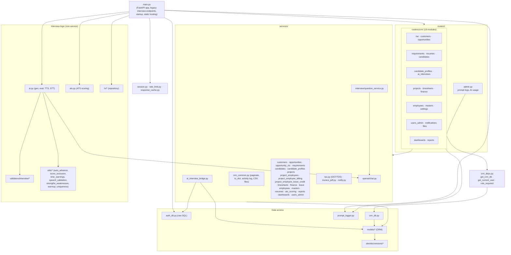
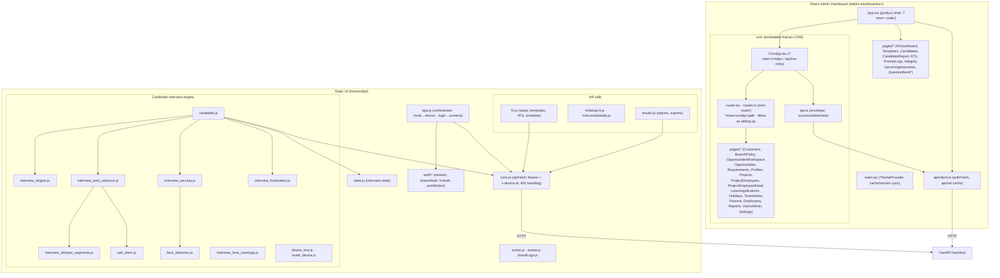
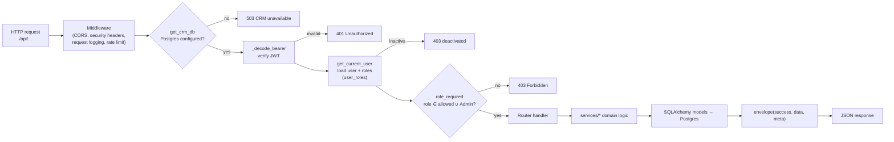
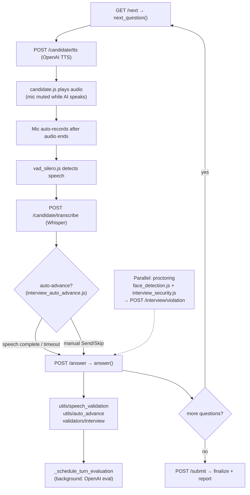
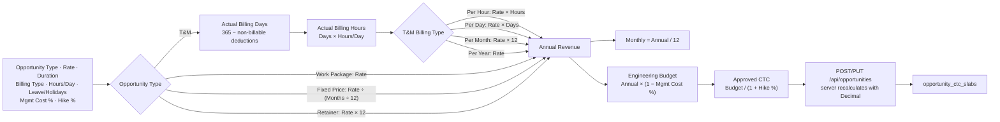

# 2. Module-wise Flow Diagrams

## 2.1 Backend module map

## 2.2 Frontend module map

**CRM mini-router filters:** `crmNavigate("timesheets?project_id=1&employee_id=2")` sets
`p=timesheets` plus sibling query keys (never baked into `p`). `TimesheetsListPage` reads
`project_id` / `employee_id` from `window.location.search` on mount. Used by Project
Employee detail → Timesheet tab → **Open timesheets**.

## 2.3 Backend request pipeline (CRM route)

## 2.4 Interview turn loop (module interaction)

## 2.5 Opportunity-type Candidate CTC Slab calculation flow

