# 2. Module-wise Flow Diagrams

## 2.1 Backend module map

```mermaid
graph TB
    main["main.py<br/>(FastAPI app, legacy interview endpoints,<br/>startup, static hosting)"]

    subgraph routers["routers/"]
        r_admin["admin.py<br/>prompt logs, AI usage"]
        subgraph rcrm["routers/crm/ (20 modules)"]
            rc1["me · customers · opportunities"]
            rc2["requirements · resumes · candidates"]
            rc3["candidate_profiles · ai_interviews"]
            rc4["projects · timesheets · finance"]
            rc5["employees · masters · settings"]
            rc6["users_admin · notifications · files"]
            rc7["dashboards · reports"]
            rc8["ai_assist (Ask AI read-only)"]
        end
    end

    subgraph aihelp["ai_help/ (Ask AI KB)"]
        ah_entries["entries.py · business_rules.py"]
        ah_loader["loader.py"]
        ah_assist["assist.py → tracked_chat_completion"]
    end

    subgraph services["services/"]
        s_bridge["ai_interview_bridge.py"]
        s_common["crm_common.py (paginate, to_dict, activity log, CSV, files)"]
        s_domain["customers · opportunities · opportunity_ctc · requirements<br/>candidates · candidate_profiles · projects<br/>project_employees · project_employee_billing<br/>project_employee_leave_credit · timesheets · finance · leave<br/>employees · masters · resumes · ats_scoring · reports · dashboards · users_admin"]
        s_tax["tax.py (GST/TDS) · tax_invoice.py (GST Tax Invoice)<br/>invoice_pdf.py · company_invoice_config.py · notify.py"]
        s_openai["openai/chat.py"]
        s_interview["interview/question_service.py"]
    end

    subgraph logic["Interview logic (non-service)"]
        ai["ai.py (gen, eval, TTS, STT)"]
        ats["ats.py (ATS scoring)"]
        validators["validators/interview/*"]
        utils["utils/* (auto_advance, score_exclusion,<br/>time_warnings, speech_validation,<br/>strengths_weaknesses, warmup, uniqueness)"]
        hr["hr/* (repository)"]
    end

    subgraph dataacc["Data access"]
        authdb["auth_db.py (raw SQL)"]
        crmdb["crm_db.py"]
        models["models/* (ORM)"]
        promptlog["prompt_logger.py"]
        alembicm["alembic/versions/*"]
    end

    deps["crm_deps.py<br/>get_crm_db · get_current_user · role_required"]
    sessionm["session.py · rate_limit.py · response_cache.py"]

    main --> routers
    main --> ai
    main --> ats
    main --> authdb
    main --> sessionm
    main --> promptlog
    rcrm --> deps
    rcrm --> services
    rc8 --> aihelp
    ah_assist --> promptlog
    r_admin --> promptlog
    services --> models
    s_bridge --> authdb
    s_bridge --> models
    deps --> crmdb
    crmdb --> models
    models --> alembicm
    ai --> s_openai
    s_interview --> s_openai
    ai --> validators
    ai --> utils
    main --> hr
```

## 2.2 Frontend module map

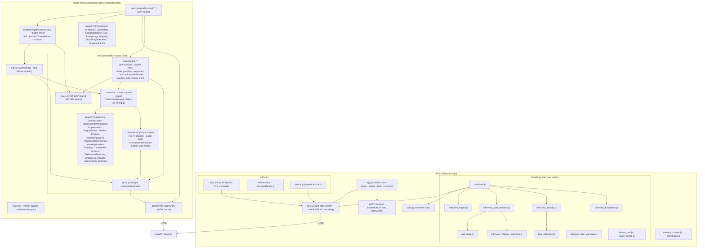

**Tax Invoice (GST module):** Backend `services/tax_invoice.py` + `routers/crm/tax_invoice.py`
owns CGST/SGST/IGST math, amount-in-words, Excel bulk, and PDF (WeasyPrint when GTK is
available; ReportLab fallback on Windows). APIs: `POST /api/invoice/totals|pdf|bulk`,
`GET /api/invoice/template`, `GET /api/states`, `GET /api/invoices/{id}/tax-invoice.pdf`.
**CRM invoice detail** (`serialize_invoice` / `POST /api/invoices` /
`POST /api/timesheets/{id}/generate-invoice` / `PATCH|PUT /api/invoices/{id}`) reuses the
same engine via `finance.compute_karnex_gst` / `karnex_gst_tax_and_grand` /
`resolve_buyer_state_code` (order: `invoice.buyer_state_code` override → branch state
2-digit → GSTIN[:2]; seller MH `"27"`; missing → zero GST + note
`"GST not computed — enter the buyer State Code"`). Detail payload exposes
`buyer_state_code` (persisted override) and
`gst: {subtotal,cgst,sgst,igst,total_gst,grand_total,intra,buyer_state_code,buyer_state_source,note?}`.
Both Generate PDF and Tax Invoice PDF use the same resolver. Frontend: route
`invoices/tax-generator` (form + white A4 preview that scales-to-fit on
smaller screens + Excel); Invoice detail shows editable **State code** next to Tax,
GST Summary / GRAND TOTAL cards, and **Tax Invoice (PDF)** downloads the server PDF. Legacy
print view remains at `invoices/:id/tax-invoice`. Seller PAN/GSTIN/bank are hardcoded
Karnex constants in the tax-invoice module. PDF footer is bank details + declaration/seal
(no SCAN TO PAY / UPI QR block). Service line text is
`Contract Staffing Service {Employee} - {Mon YYYY}` (short month + year from timesheet). PDF amounts
use prefix `INR ` (not `₹`).

**Platform top bar:** sticky glass header in `components/platform-nav/PlatformTopBar.tsx`
(all section tabs inline on desktop with in-capsule scroll if needed, icon-first right actions, full-height
mobile navigation sheet, **Interview Schedule** CTA, ⌘K/Ctrl+K command palette, **ThemePicker** for day/night + accent colors
(`theme/ThemePicker.tsx`, `data-accent` on `<html>`), single account dropdown for theme /
role label / profile / logout). Destinations and RBAC unchanged from the former inline
header in `App.tsx`. **Day theme tokens** use **Dune Glow** (warm ivory/sand `--surface-*`,
amber aurora/hairline/elev glows in `src/styles/tokens.css` + design-system primitives);
**night** (`html.dark`) stays the prior indigo/navy mesh — day-only token overrides.

**CRM mini-router filters:** `crmNavigate("timesheets?project_id=1&employee_id=2")` sets
`p=timesheets` plus sibling query keys (never baked into `p`). `TimesheetsListPage` reads
`project_id` / `employee_id` from `window.location.search` on mount. Used by Project
Employee detail → Timesheet tab → **Open timesheets**.

## 2.3 Backend request pipeline (CRM route)

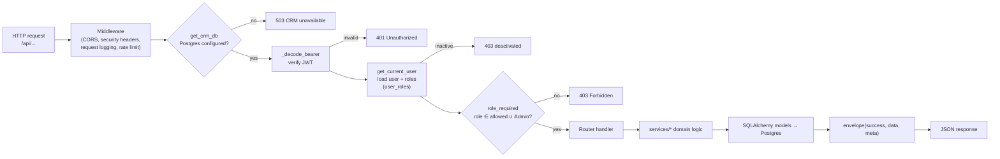

## 2.4 Interview turn loop (module interaction)

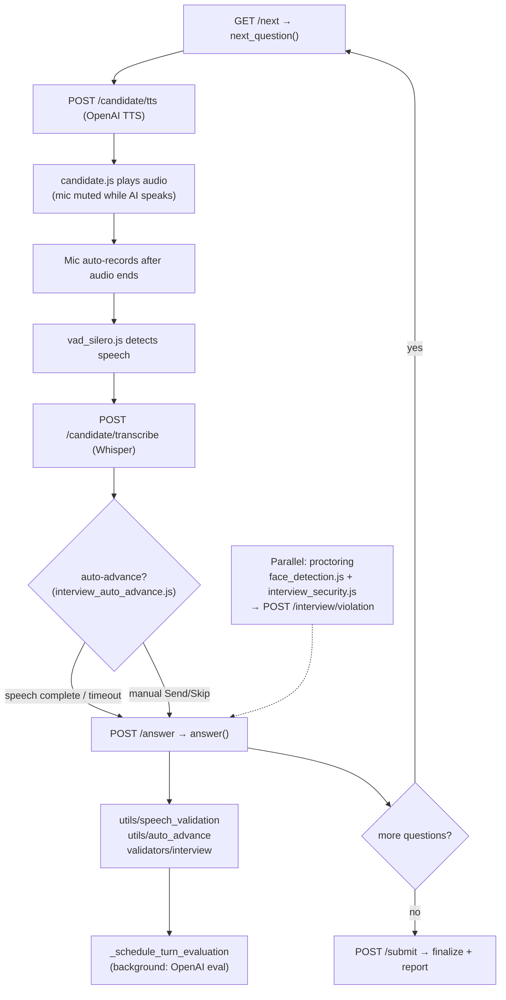

## 2.5 Opportunity-type Candidate CTC Slab calculation flow

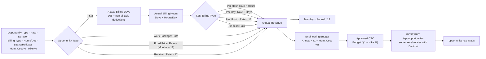

## 2.6 Opportunity form value-conditional fields (`showWhen`)

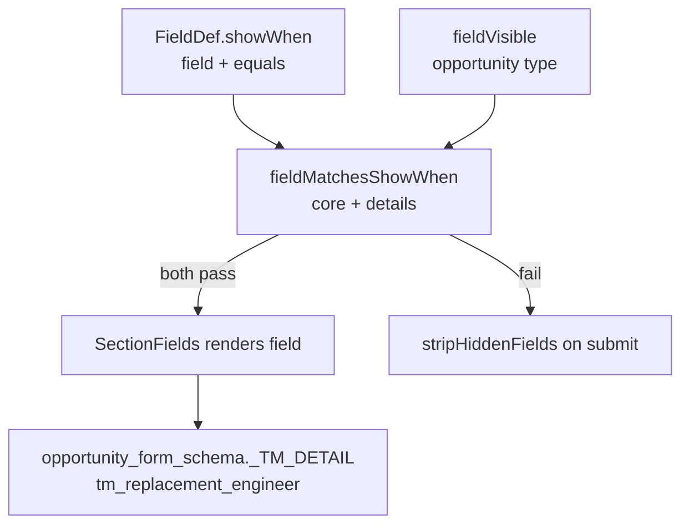

Example: `tm_replacement_engineer` (searchable) appears only when `tm_position_type = Replacement` (T&M). Selecting an engineer auto-fills `tm_role` from project-employee / employee `role_title`.

## 2.7 CRM wizard chrome (Opportunity + Customer)

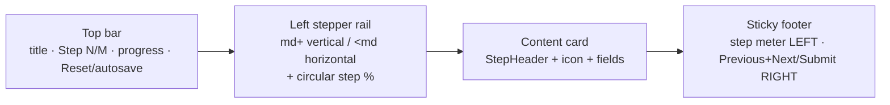

Shared presentational pieces live in `admin-dashboard/src/crm/components/wizard/`
(`WizardTopBar`, `WizardStepper`, `SectionHeaderBanner`, `WizardStepProgress`, `WizardFooter`, `WizardShell`)
plus legacy `WizardChrome.tsx` / `WizardAurora.tsx` (moonlit backdrop: moon glow, aurora blobs,
starfield — visual-only; `useReducedMotion` → static). Opportunity, Customer, and New/Edit Employee
full-screen modals share `scopeClassName="crm-wizard wiz-noise"` + `wiz-moonlit-*` panel chrome from
`wizard/premium.css`. **Day/night:** `.crm-wizard` defaults to **Dune Glow** day `--wiz-*` (sand
fallbacks + warm umber shadows / amber noise; violet brand accents intentional); `html.dark`
restores navy moonlit chrome (moon/stars/veil only in night) plus deeper cinematic form
ambience (vignette shell, recessed inputs, violet-halo cards). Platform forms
(HrSetup / QuestionBank / TemplateForm) mirror the same night card/input depth via
`platform-form-*` classes in `styles/tokens.css` (no CRM kit import). Form-adjacent
chrome (`FileUpload` preview modal, `Timeline`) uses app surface/text/border tokens — no cool
slate utilities. Single-screen dialogs use local `WizFormShell` + `SectionHeaderBanner` under the
same tokens. List tables use `DataTable.rowActions` + `components/RowActions.tsx` (Edit / Delete + `ConfirmModal`;
on success `afterListDelete` drops the row immediately then soft-refreshes; `DataTable` keeps
existing rows visible while reloading. Delete calls `crmDelete` — 409 `detail` is shown inline; **Delete is disabled after a
dependency error** (Cancel → Close); Employee rows expose a secondary **Deactivate**
action when hard-delete is blocked. Backend cascades safe owned children on delete
(see `services/crm_delete.py`): opportunity → requirements/profiles/AI links;
candidate → profiles/AI links/bookings; invoice → unpaid TDS; PO → deletable invoices;
project/PE → draft+uninvoiced paths and deletable invoices. Hard blockers
(payments, credit notes, projects-on-opportunity, approved leave) still return
numbered 409s. Reports remain analytics-only with no row actions).

| Form | File | Steps |
|------|------|-------|
| New Opportunity | `pages/opportunity/NewOpportunityForm.tsx` | Schema-driven (~10–11); autosave draft; moonlit `WizardAurora` |
| Edit Opportunity | same `NewOpportunityForm` (`opportunityId`) | List-row pencil → GET+hydrate → full wizard → PUT + skills replace + `version` |
| New/Edit Customer | `components/CustomerFormModal.tsx` | 5 fixed sections; Leave & Holiday Billing merges Comp Off + Attendance Rule; moonlit `WizardAurora` |
| New/Edit Employee | `pages/Employees.tsx` (`EmployeeFormModal`) | Single-screen create/edit; same moonlit family |
| Edit Branch | `components/BranchWizardModal.tsx` | 4 steps: Branch Info → Holiday Billing Policy → Leave & Holiday Billing Policy (includes Billable Leave dialog) → Billing Properties |
| New/Edit Project | `components/EditProjectWizard.tsx` | Create: Details (Name/Opp/Customer/**Branch** SearchableSelect) → Leave & Holiday Billing Policy → Billing Properties; Branch required when customer has branches; selecting branch prefills policy (confirm on change) and POSTs/PUTs `branch_id` |
| New/Edit Purchase Order | `pages/Finance.tsx` (`POFormModal`) | List pencil / detail **Edit** → GET hydrate → wizard (Header → Address → **Commercial** → **Allocate** → Review); create `POST /api/purchase-orders`, edit `PUT /api/purchase-orders/{id}` (customer locked); address snapshots; Commercial GST % + IGST; allocate optional on create / shown locked if already allocated; detail: commercial + `GET …/invoices`; expiry report 45d |

Both wizards place **Previous and Next (or Submit) together on the bottom-right**. Navigation,
per-step validation, and submit stay in each form file.

## 2.8 Timesheet weekend / holiday work billing (precedence)

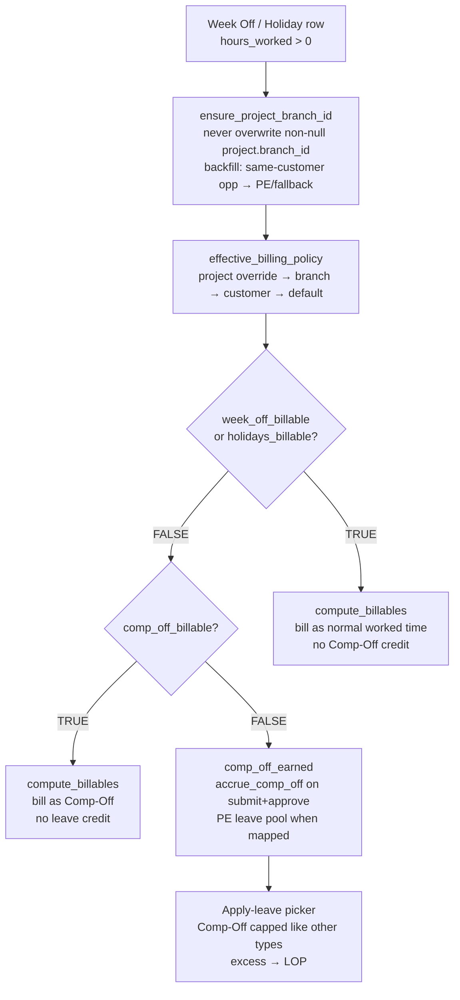

Branch linkage: `project.branch_id` is authoritative once set; `ensure_project_branch_id`
never overwrites it. Backfill (when null) prefers same-customer `opportunity.branch_id`,
then PE/display fallbacks. Logs `project_opportunity_branch_disagree` when the two FKs
differ. Stale non-null project billable overrides (`weekoff_billable` / `comp_off_billable`)
shadow branch flags — clear them to inherit branch policy.

Precedence: `week_off_billable` / `holidays_billable` > `comp_off_billable` > leave credit.
Bill XOR credit (never both). Pure holiday-off (0 hours) still uses `holidays_billable` only.
Leave consume + Comp-Off accrue run on **submit** (idempotent with approve); reject and
`DELETE /api/timesheets/{id}` call `reverse_timesheet_ledger_effects` (re-credit leave,
reverse Comp-Off) before status change / hard-delete. Delete allows Draft/Submitted/
Approved/Rejected; still 409 when an invoice is linked. Commit paths row-lock PE/employee
balances (`FOR UPDATE` on Postgres; skipped on SQLite).

## 2.8b Timesheet summary leave / Loss of Pay (read path)

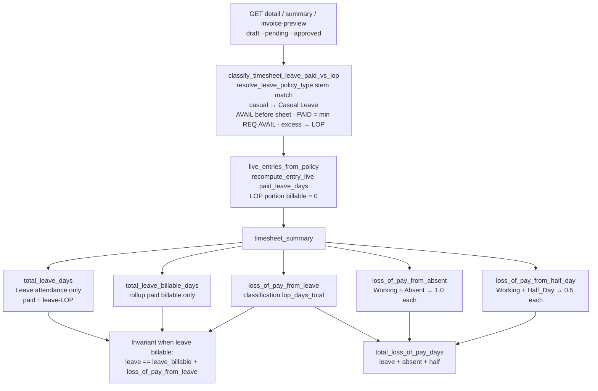

Summary tiles (and `GET /api/timesheets/{id}/summary`) compute leave/LOP on **read** the
same way billable recompute does — LOP is visible on unapproved sheets, not only after
approve/consume. **Total Loss of Pay Days** = leave excess + Working Absent (1.0) +
Working Half_Day (0.5). Absent/Half_Day are **not** leave days. Invoice Details shows
`loss_of_pay_days` as a display column only (billed qty/amount unchanged). Frontend
Summary prefers server values when clean; when the grid is dirty it mirrors
`classifyLeavePaidVsLop` plus the same Absent/Half_Day formula.
## 2.9 PE leave accrual start (`effective_date`)

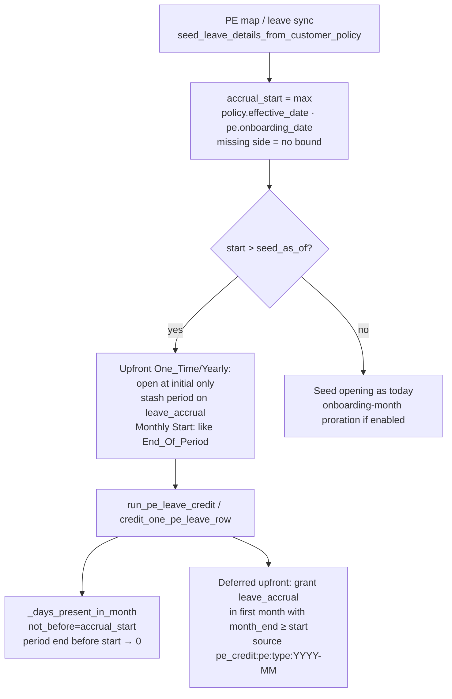

Policy `effective_date` edits never rewrite existing PE leave rows; only new seeds and
future credit-job runs observe the new lower bound (no clawback of already-credited months).

`leave_credit_timing` / `leave_expire_timing` (`Start_Of_Period` | `End_Of_Period`) are
stored on `customer_leave_policies` and `project_leave_policies`, serialized on PE
`leave_detail_out`, and edited via the shared admin `PeriodTimingPicker`. Credit timing
still drives accrual/upfront math; expire timing is contractual/display metadata and does
not change the cycle-expiry engine.

## 2.10 Leave policy resolution (crediting vs billability)

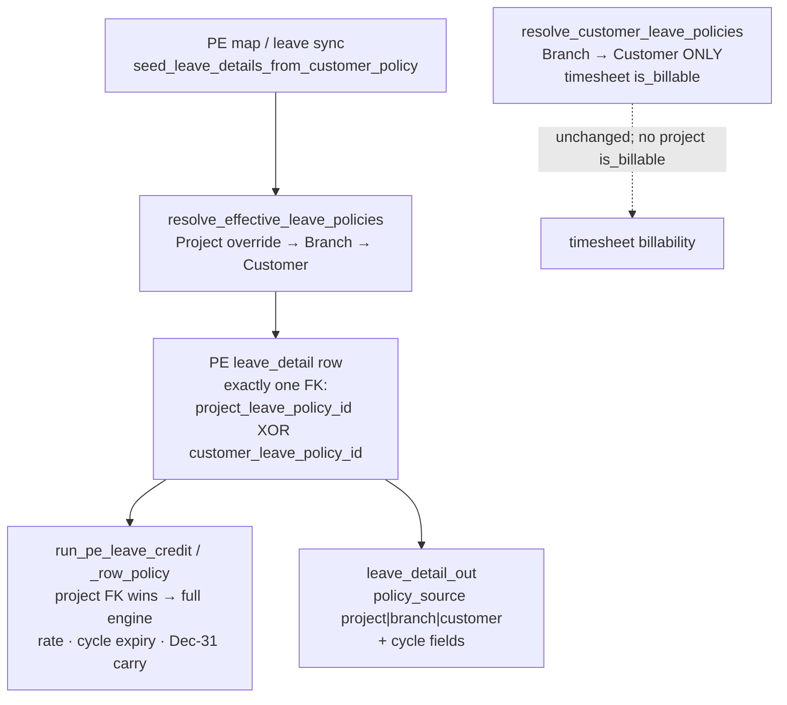

- **Branch = master, project = exception.** Customer form leave rows are fallbacks for
  branches without their own policy; opportunity Leave & Holiday Details are estimation-only
  and prefill Holidays/Weekoff/Leave **only** when `effective-policy.sources.leave_total === "branch"`
  (a leave policy is linked to that branch) — otherwise those fields stay blank (no 10/104/24 defaults).
- Existing PE balances are never rewritten on policy edit; only new seeds and future credit
  runs observe overrides. `sync_pe_leave_from_customer_policy` back-fills missing types only.
