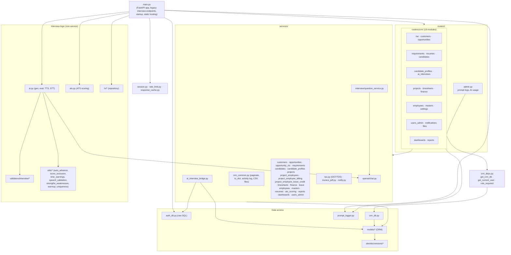
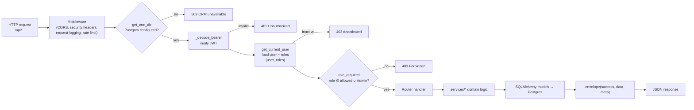
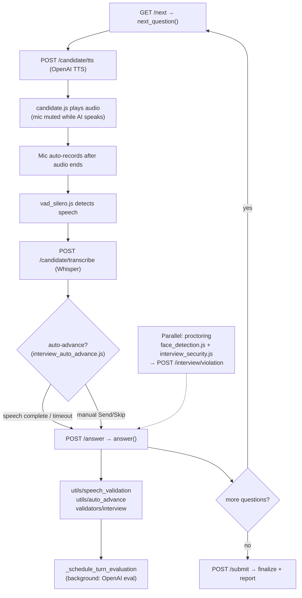
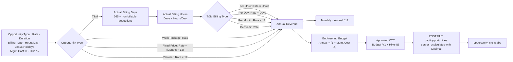
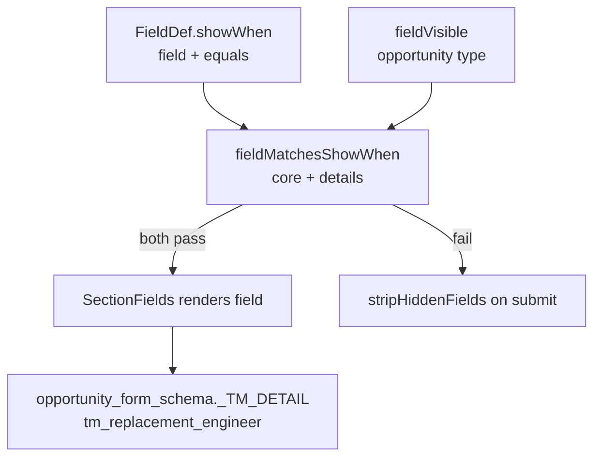
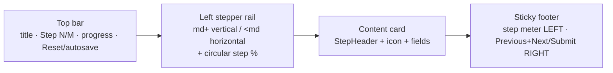
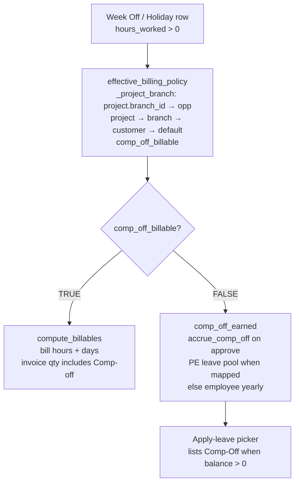
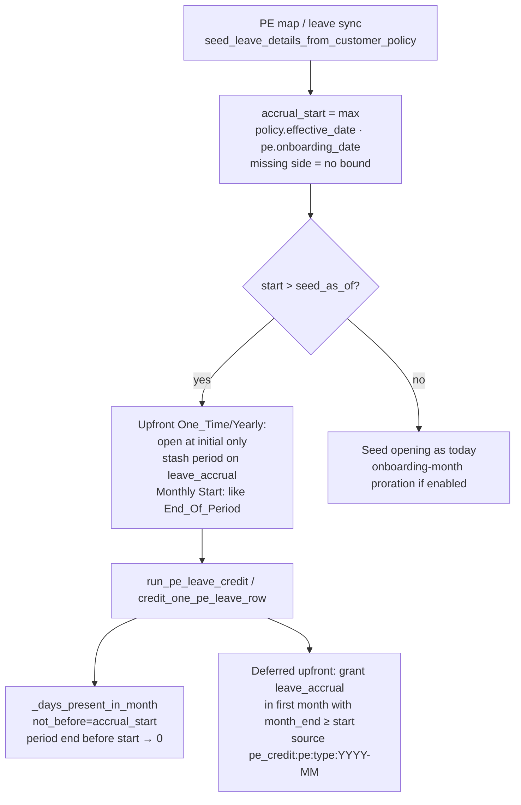

# 2. Module-wise Flow Diagrams

## 2.1 Backend module map

## 2.2 Frontend module map

```mermaid
graph TB
    subgraph static["Static UI (frontend/js/)"]
        appjs["app.js (orchestrator: invite→device→login→screens)"]
        core["core.js (apiFetch: Bearer + x-device-id, 401 handling)"]
        state["state.js (interview state)"]
        auth["auth/* (session, sharedAuth, hrAuth, authMotion)"]
        subgraph candidate_side["Candidate interview engine"]
            candjs["candidate.js"]
            engine["interview_engine.js"]
            autoadv["interview_auto_advance.js"]
            whisper["interview_whisper_segments.js"]
            vad["vad_silero.js"]
            security["interview_security.js"]
            face["face_detection.js"]
            finalize["interview_finalization.js"]
            timew["interview_time_warnings.js"]
            devtest["device_test.js · invite_device.js"]
        end
        subgraph hr_side["HR side"]
            hrjs["hr.js (setup, templates, ATS, schedule)"]
            hrsetup["hrSetupUi.js · hrAccessDetails.js"]
            results["results.js (reports, exports)"]
        end
        scene["scene.js · avatar.js · brandLogo.js"]
    end

    subgraph react["React Admin Dashboard (admin-dashboard/src)"]
        maintsx["main.tsx (ThemeProvider, cache/version sync)"]
        apptsx["App.tsx (product shell, ?view= router)"]
        topbar["PlatformTopBar (sticky tabs · More overflow · ⌘K · account menu)"]
        pages["pages/* (HrDashboard, Templates, Candidates,<br/>CandidateReport, ATS, PromptLogs, Integrity,<br/>UpcomingInterviews, QuestionBank*)"]
        apiclient["api/client.ts (authFetch, apiGet cache)"]
        subgraph crmapp["crm/ (embedded Karnex CRM)"]
            crmroot["CrmApp.tsx (?view=crm&p=, /api/me roles;<br/>desktop sidebar: expanded ↔ icon rail → localStorage)"]
            crmnav["nav.ts (CRM_NAV shared with ⌘K palette)"]
            crmrouter["router.tsx · routes.ts (mini-router)<br/>?view=crm&amp;p=path · filters as sibling qs"]
            crmapi["api.ts (envelope: success/data/meta)"]
            crmpages["pages/* (Customers, BranchPolicy, OpportunitiesWorkspace,<br/>Opportunities, Requirements, Profiles, Projects,<br/>ProjectEmployees, ProjectEmployeeDetail,<br/>LeaveApplications, Holidays, Timesheets,<br/>Finance, Employees, Reports, UsersAdmin, Settings)"]
        end
    end

    appjs --> core
    appjs --> auth
    candjs --> core
    candjs --> state
    candjs --> engine
    candjs --> autoadv
    autoadv --> vad
    autoadv --> whisper
    candjs --> security
    security --> face
    candjs --> finalize
    hrjs --> core
    results --> core
    apptsx --> topbar
    apptsx --> pages
    apptsx --> apiclient
    apptsx --> crmroot
    topbar --> crmnav
    crmroot --> crmnav
    crmroot --> crmrouter
    crmroot --> crmapi
    crmrouter --> crmpages
    crmapi --> apiclient

    core -->|HTTP| backend["FastAPI backend"]
    apiclient -->|HTTP| backend
```

**Platform top bar:** sticky glass header in `components/platform-nav/PlatformTopBar.tsx`
(section tabs with **More** overflow on narrow widths, hamburger on mobile, **Interview Schedule**
CTA, ⌘K/Ctrl+K command palette, single account dropdown for theme / role label / profile /
logout). Destinations and RBAC unchanged from the former inline header in `App.tsx`.

**CRM mini-router filters:** `crmNavigate("timesheets?project_id=1&employee_id=2")` sets
`p=timesheets` plus sibling query keys (never baked into `p`). `TimesheetsListPage` reads
`project_id` / `employee_id` from `window.location.search` on mount. Used by Project
Employee detail → Timesheet tab → **Open timesheets**.

## 2.3 Backend request pipeline (CRM route)

## 2.4 Interview turn loop (module interaction)

## 2.5 Opportunity-type Candidate CTC Slab calculation flow

## 2.6 Opportunity form value-conditional fields (`showWhen`)

Example: `tm_replacement_engineer` (searchable) appears only when `tm_position_type = Replacement` (T&M). Selecting an engineer auto-fills `tm_role` from project-employee / employee `role_title`.

## 2.7 CRM wizard chrome (Opportunity + Customer)

Shared presentational pieces live in `admin-dashboard/src/crm/components/WizardChrome.tsx`
(`WizardTopBar`, `WizardStepper`, `WizardStepHeader`, `WizardStepProgress`, `WizardFooter`)
plus `WizardAurora.tsx` (moonlit backdrop: moon glow, aurora blobs, starfield, grain — visual-only;
`useReducedMotion` → static). Opportunity, Customer, and New/Edit Employee full-screen modals share
`scopeClassName="crm-wizard wiz-noise"` + `wiz-moonlit-*` panel chrome from `wizard/premium.css`.
List tables use `DataTable.rowActions` + `components/RowActions.tsx` (Edit / Delete + `ConfirmModal`;
Delete calls `crmDelete` — 409 `detail` is shown inline; **Delete is disabled after a
dependency error** (Cancel → Close); Employee rows expose a secondary **Deactivate**
action when hard-delete is blocked. Backend cascades safe owned children on delete
(see `services/crm_delete.py`): opportunity → requirements/profiles/AI links;
candidate → profiles/AI links/bookings; invoice → unpaid TDS; PO → deletable invoices;
project/PE → draft+uninvoiced paths and deletable invoices. Hard blockers
(payments, credit notes, projects-on-opportunity, approved leave) still return
numbered 409s. Reports remain analytics-only with no row actions).

| Form | File | Steps |
|------|------|-------|
| New Opportunity | `pages/opportunity/NewOpportunityForm.tsx` | Schema-driven (~10–11); autosave draft; moonlit `WizardAurora` |
| New/Edit Customer | `components/CustomerFormModal.tsx` | 5 fixed sections; Leave & Holiday Billing merges Comp Off + Attendance Rule; moonlit `WizardAurora` |
| New/Edit Employee | `pages/Employees.tsx` (`EmployeeFormModal`) | Single-screen create/edit; same moonlit family |
| Edit Branch | `components/BranchWizardModal.tsx` | 4 steps: Branch Info → Holiday Billing Policy → Leave & Holiday Billing Policy (includes Billable Leave dialog) → Billing Properties |
| New/Edit Project | `components/EditProjectWizard.tsx` | Create: Details (Name/Opp/Customer/**Branch** SearchableSelect) → Leave & Holiday Billing Policy → Billing Properties; Branch required when customer has branches; selecting branch prefills policy (confirm on change) and POSTs/PUTs `branch_id` |

Both wizards place **Previous and Next (or Submit) together on the bottom-right**. Navigation,
per-step validation, and submit stay in each form file.

## 2.8 Timesheet Comp Off Billable (weekend / holiday work)

Mutually exclusive: never both bill and credit. Pure holiday-off (0 hours) still uses
`holidays_billable`. Week Off hours are editable in the daily grid; calendar holidays stay locked.

## 2.9 PE leave accrual start (`effective_date`)

Policy `effective_date` edits never rewrite existing PE leave rows; only new seeds and
future credit-job runs observe the new lower bound (no clawback of already-credited months).
