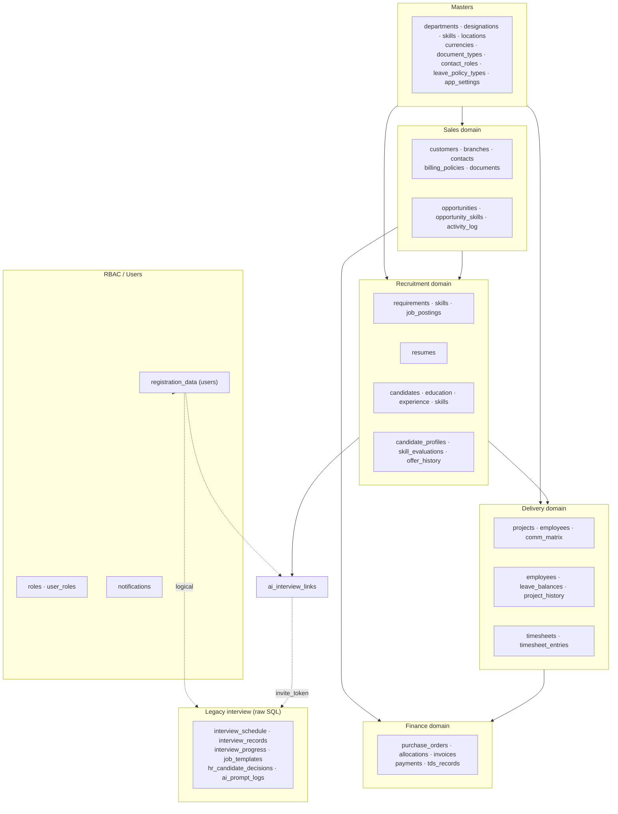
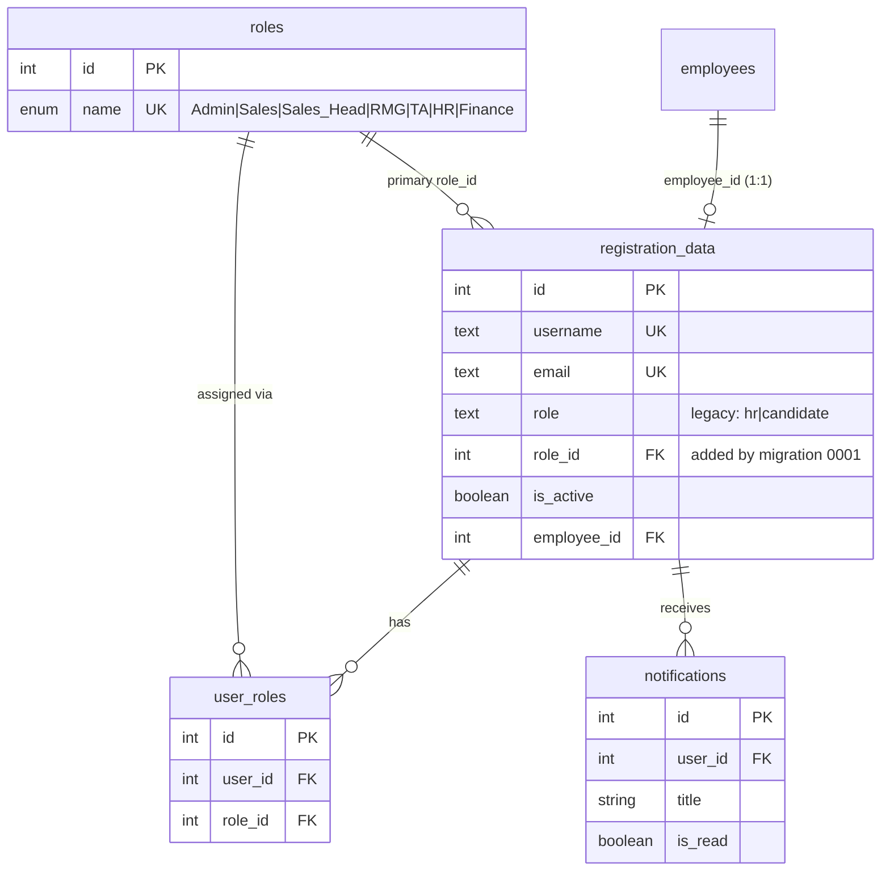
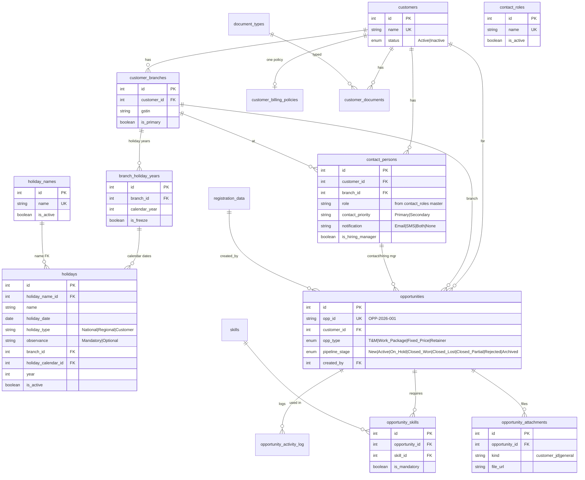
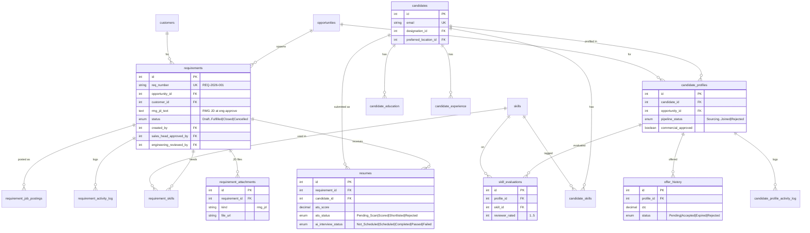
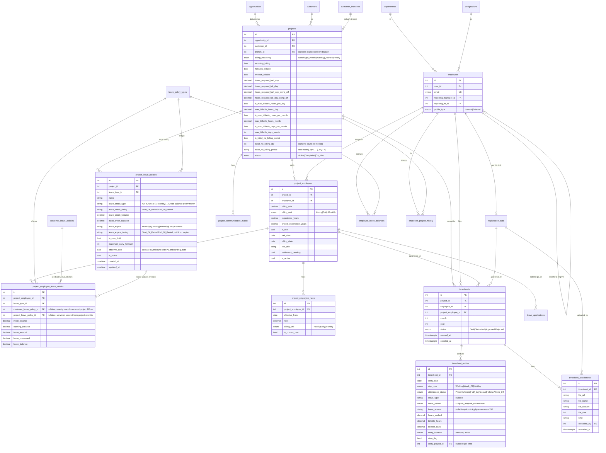
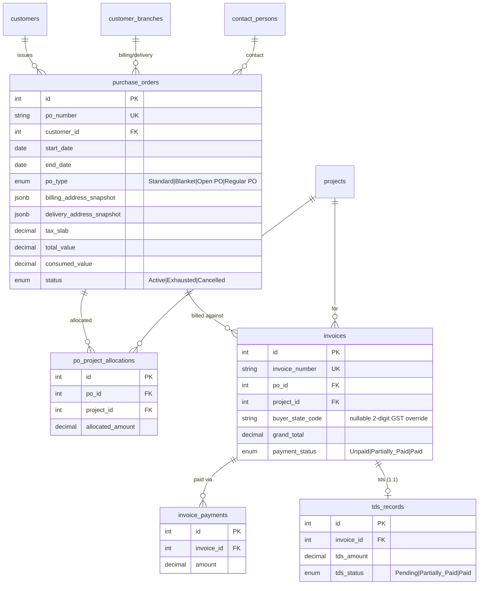
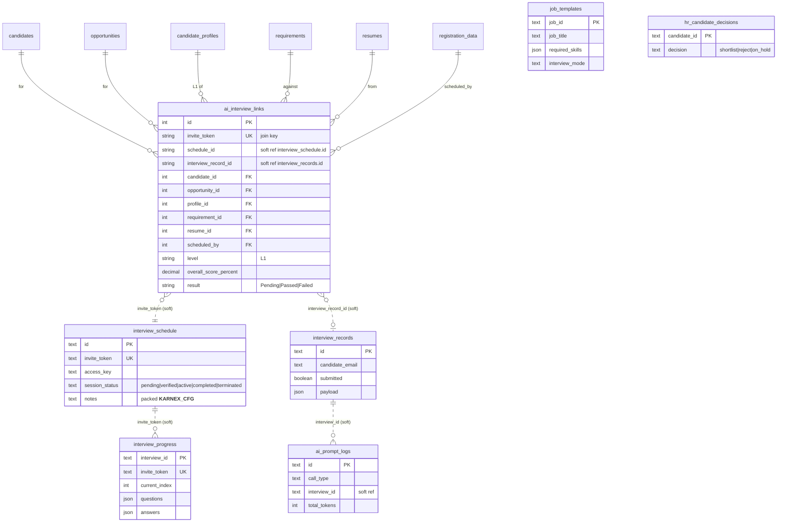

# 3. Database ER Diagrams

The database holds **two coexisting schemas** in one PostgreSQL instance:

- **CRM tables** — SQLAlchemy ORM (`models/*`), managed by Alembic.
- **Legacy interview tables** — raw SQL (`auth_db.py`, `prompt_logger.py`), never touched by Alembic.

They connect only through the shared users table `registration_data` and the
`ai_interview_links` bridge (join key `invite_token`). Because ER diagrams get large,
they are split by domain. `registration_data` (users) is the central hub.

## 3.1 Domain overview (table clusters)

## 3.2 RBAC & Users

## 3.3 Sales domain (Customers → Opportunities)

## 3.4 Recruitment domain (Requirements → Resumes → Candidates → Profiles)

## 3.5 Delivery domain (Projects → Employees → Timesheets)

## 3.6 Finance domain (Purchase Orders → Invoices → Payments/TDS)

## 3.7 AI-Interview bridge & legacy tables

The CRM half is fully relational; the legacy interview half is a loosely-coupled
document/JSON store. They connect **only** through `ai_interview_links` (via
`invite_token`) and the shared `registration_data` users table. Dashed = soft/logical
join (no DB-level FK).

## 3.8 Full FK reference

The complete list of foreign-key edges (source → target) is maintained inline in each
domain diagram above. Central hub tables by inbound-FK count: **`registration_data`**
(users, ~15 inbound), then `customers`, `opportunities`, `candidates`, `projects`,
`skills`, `requirements`, `candidate_profiles`, `employees`.
