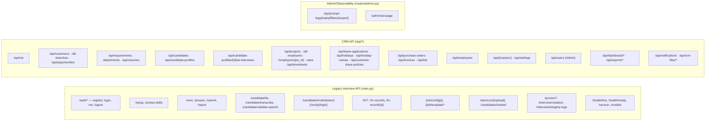
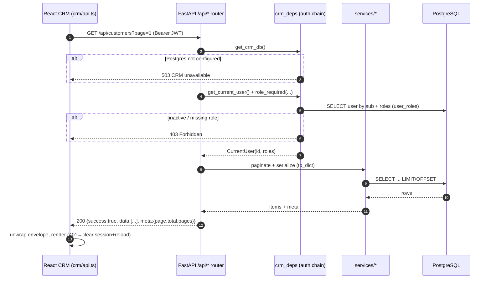
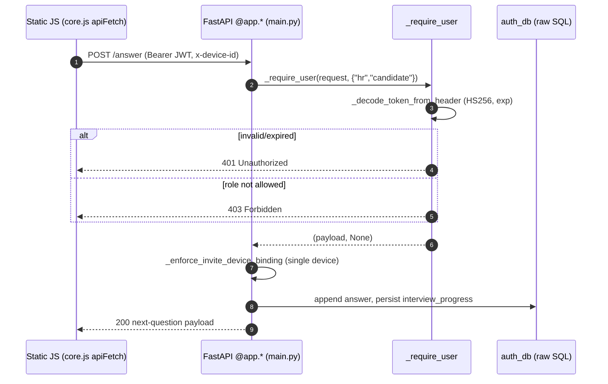
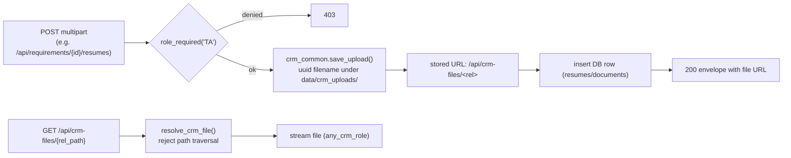
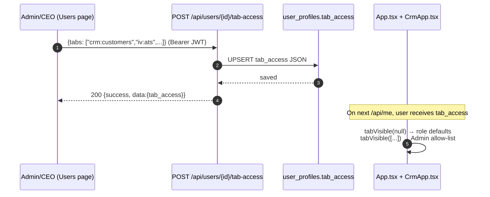
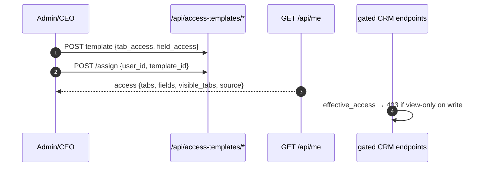
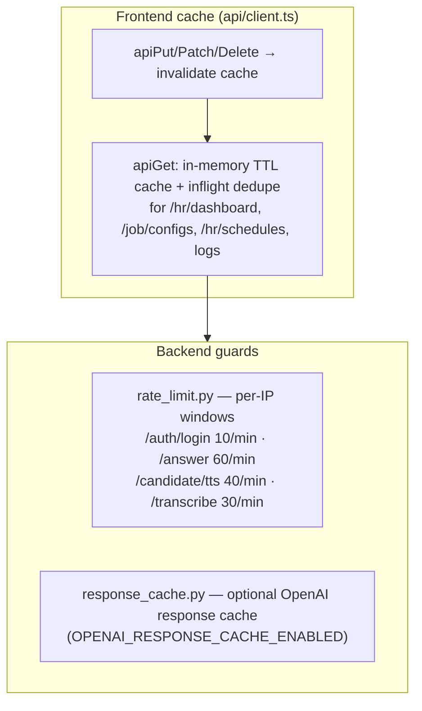
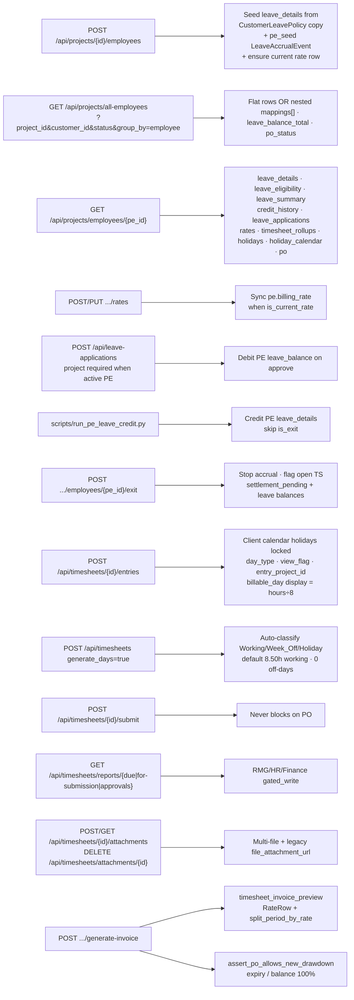
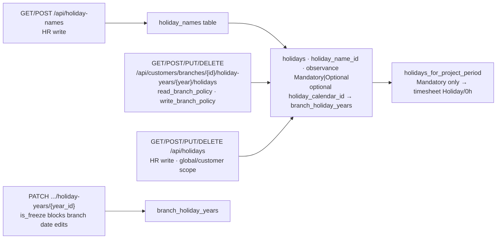

# 4. API Request/Response Flow Diagrams

Two API surfaces share the same host and JWT:

- **Legacy interview API** — routes defined directly in `main.py` (`@app.*`), authorized
  by the JWT `role` claim via `_require_user`.
- **Karnex CRM API** — 19 routers under `/api/*`, authorized by DB-backed RBAC via
  `role_required`, returning a uniform envelope `{success, data, message, errors, meta}`.

## 4.1 API surface map

## 4.2 CRM request/response envelope flow

## 4.3 Legacy interview auth flow (role-claim)

## 4.4 File upload flow (multipart, e.g. resume / CV / documents)

## 4.5 Per-user tab access (Admin/CEO)

Admin/CEO assigns an explicit allow-list of UI tab keys per user via
`POST /api/users/{id}/tab-access`. Stored in `user_profiles.tab_access` (JSON text).
`NULL` → role-based sidebar defaults; non-null → only listed keys appear in the shell.

## 4.5b Access Templates (department/role-wise modes)

Reusable templates (`access_templates`) grant per-tab and per-field **view** or **edit**
modes. Users link via `user_profiles.access_template_id` (live — edits propagate).
`services.access_templates.effective_access()` merges template + per-user override (override wins).
Admin/CEO always get `full: true`.

**Enforcement:** `crm_deps.gated_read(tab, *roles)` / `gated_write(tab, *roles)` on major CRM
routers (customers, opportunities, projects, finance, employees, timesheets, …).

## 4.6 Response caching & rate limiting (cross-cutting)

## 4.7 Project Employee ownership (delivery bridge)

## 4.7 Customer Holiday Calendar (branch-year + names master)

