# 4. API Request/Response Flow Diagrams

Two API surfaces share the same host and JWT:

- **Legacy interview API** — routes defined directly in `main.py` (`@app.*`), authorized
  by the JWT `role` claim via `_require_user`.
- **Karnex CRM API** — 20 routers under `/api/*`, authorized by DB-backed RBAC via
  `role_required`, returning a uniform envelope `{success, data, message, errors, meta}`.

## 4.1 API surface map

```mermaid
graph LR
    subgraph legacy["Legacy Interview API (main.py)"]
        auth["/auth/* — register, login, me, logout"]
        setup["/setup, /extract-skills"]
        loop["/next, /answer, /submit, /report"]
        media["/candidate/tts, /candidate/transcribe, /candidate/validate-speech"]
        invite["/candidate/invite/{token}[/verify|/login]"]
        hrrec["/hr/*, /hr-records, /hr-record/{id}"]
        job["/job/config[s], /job/template/*"]
        atsapi["/ats/score[/upload], /candidates/ranked"]
        proctor["/proctor/*, /interview/violation, /interview/integrity-logs"]
        health["/health/live, /health/ready, /version, /models"]
    end

    subgraph crm["CRM API (/api/*)"]
        me["/api/me · /project-leave · /leave-balances"]
        customers["/api/customers · DELETE (cascade policies/holidays) · /all-branches<br/>POST/PUT …/contacts (Sales/Sales_Head/Finance) · /api/opportunities · DELETE (cascade req/profile/AI)"]
        req["/api/requirements · attachments · /api/resumes"]
        candp["/api/candidates · DELETE (cascade profiles) · /api/candidate-profiles"]
        aiint["/api/candidate-profiles/{id}/ai-interviews"]
        proj["/api/projects · DELETE /{id} (cascade PE/TS/unpaid INV)<br/>/all-employees · /employees/{pe_id} · DELETE employees/{pe_id}<br/>rates · leave-policies · /api/timesheets · DELETE /{id}"]
        leave["/api/leave-applications · DELETE /{id}<br/>/api/holidays · /api/holiday-names · /api/customer-leave-policies"]
        finance["/api/purchase-orders · /api/purchase-orders/{id}/invoices · /api/invoices · /api/tds<br/>Tax Invoice: /api/invoice/totals|pdf|bulk|template · /api/states<br/>GET /api/invoices/{id}/tax-invoice.pdf"]
        emp["/api/employees · DELETE (prefer deactivate)"]
        mast["/api/{masters} · /api/contact-roles · /api/settings"]
        usersadm["/api/users (Admin)"]
        dash["/api/dashboard/* · /api/reports/*"]
        notif["/api/notifications · /api/crm-files/*"]
        tplreq["/api/template-requests · DELETE /{id}"]
        askai["/api/ai/assist · /api/ai/help-context<br/>(Ask AI read-only help · any_crm_role · 20/min)"]
    end

    subgraph observ["Admin/Observability (routers/admin.py)"]
        plogs["/api/prompt-logs[/stats|/filters|/export]"]
        usage["/admin/ai/usage"]
    end
```

## 4.1b Ask AI (read-only help)

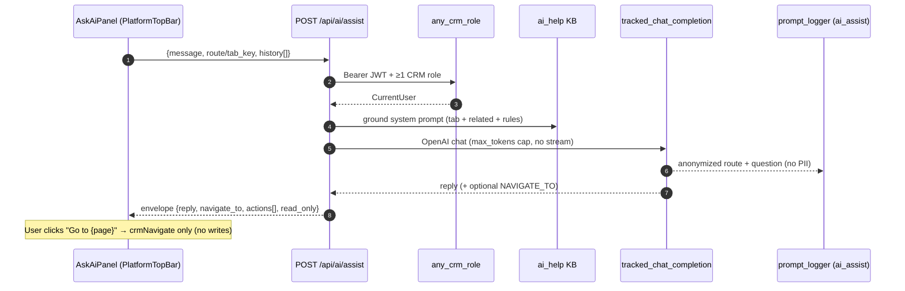

## 4.2 CRM request/response envelope flow

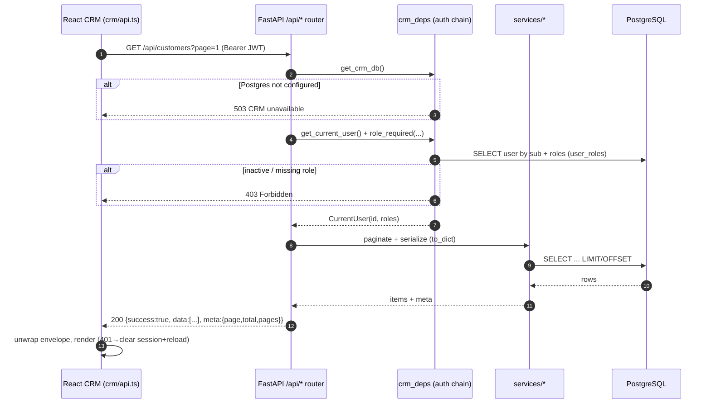

## 4.3 Legacy interview auth flow (role-claim)

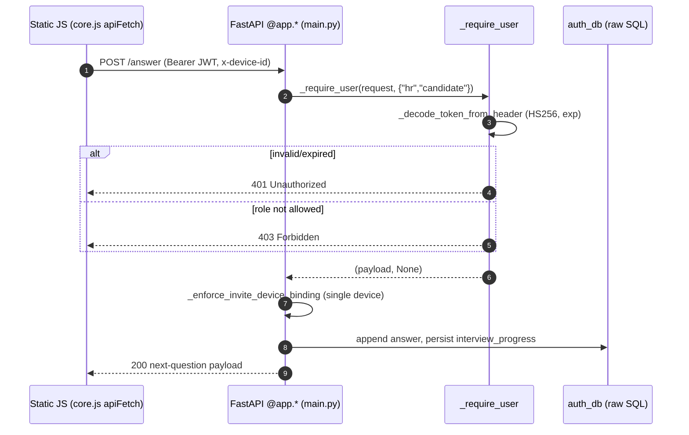

## 4.4 File upload flow (multipart, e.g. resume / CV / documents)

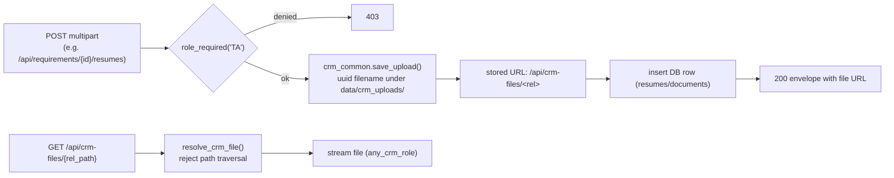

## 4.5 Per-user tab access (Admin/CEO)

Admin/CEO manage application login accounts on the Users page (`#/crm/users`):
create with email + password + CRM roles (`POST /api/users`), replace roles,
activate/deactivate, and delete. `GET /api/users` lists legacy `role='hr'`
accounts only (candidate interview logins are excluded). Deactivated users are
rejected at `POST /auth/login` as well as on CRM `/api/me`. Hard delete
(`DELETE /api/users/{id}`) detaches/reassigns FK refs to the acting Admin/CEO
when possible.

Admin/CEO also assign an explicit allow-list of UI tab keys per user via
`POST /api/users/{id}/tab-access`. Stored in `user_profiles.tab_access` (JSON text).
`NULL` → role-based sidebar defaults; non-null → only listed keys appear in the shell.

Users update their own profile (name, phone, password, avatar) via
`GET/PATCH /api/me/profile` and `POST /api/me/change-password` — Admin does not
edit another user’s password from the Users page.

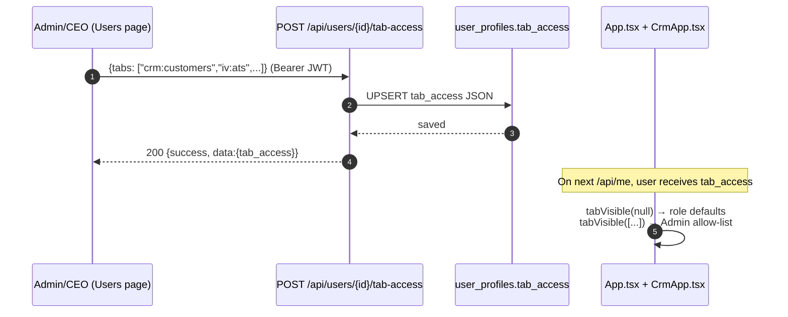

## 4.5b Access Templates (department/role-wise modes)

Reusable templates (`access_templates`) grant per-tab and per-field **view** or **edit**
modes. Users link via `user_profiles.access_template_id` (live — edits propagate).
`services.access_templates.effective_access()` merges template + per-user override (override wins).
Admin/CEO always get `full: true`.

**Enforcement:** `crm_deps.gated_read(tab, *roles)` / `gated_write(tab, *roles)` on major CRM
routers (customers, opportunities, projects, finance, employees, timesheets, …).

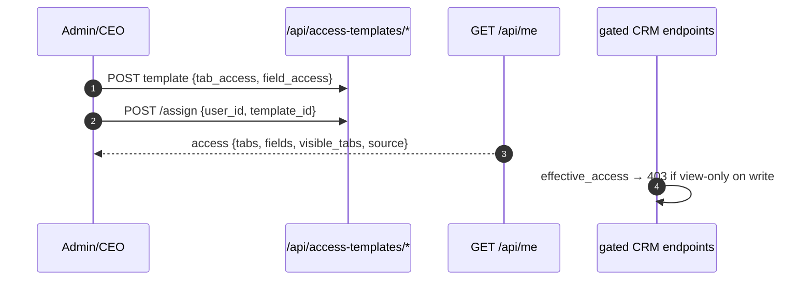

## 4.6 Response caching & rate limiting (cross-cutting)

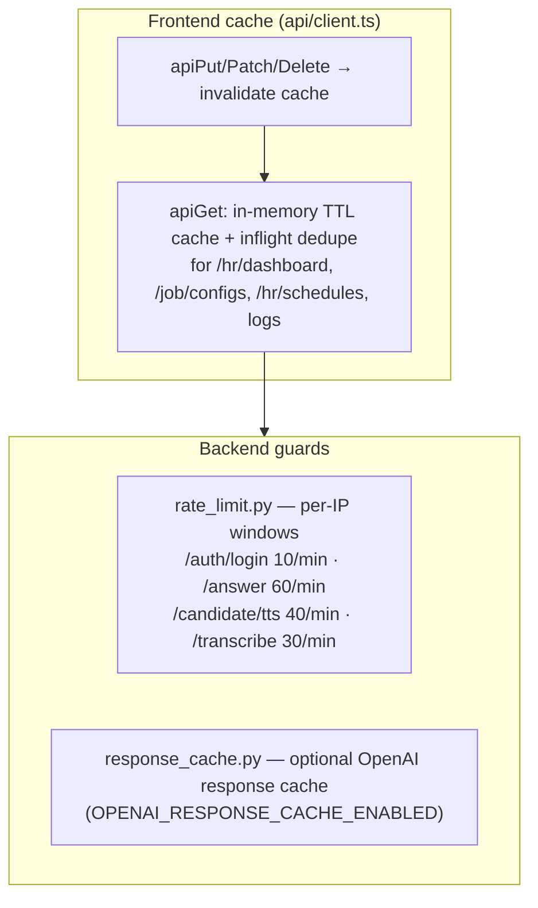

## 4.7 Project Employee ownership (delivery bridge)

```mermaid
flowchart LR
    map["POST /api/projects/{id}/employees"] --> seed["Seed leave_details from<br/>CustomerLeavePolicy copy<br/>accrual_start=max(effective,onboard)<br/>defer upfront if start future<br/>+ pe_seed LeaveAccrualEvent<br/>+ ensure current rate row"]
    list["GET /api/projects/all-employees<br/>?project_id&customer_id&status&group_by=employee"] --> enrich["Flat rows OR nested mappings[] · leave_balance_total · po_status"]
    detail["GET /api/projects/employees/{pe_id}"] --> nested["leave_details · leave_eligibility · leave_summary<br/>credit_history · leave_applications<br/>rates · timesheet_rollups · holidays · holiday_calendar · po<br/>+ customer_id/name · branch_id/name · project_name"]
    syncLeave["POST .../employees/{pe_id}/leave/sync"] --> seedGap["Idempotent seed missing leave types<br/>(Admin/HR; no balance reset)"]
    rates["POST/PUT .../rates"] --> sync["Sync pe.billing_rate<br/>when is_current_rate"]
    leaveApp["POST /api/leave-applications<br/>project required when active PE"] --> peBal["Debit PE leave_balance on approve"]
    credit["scripts/run_pe_leave_credit.py"] --> peBal2["Credit PE leave_details<br/>accrual_start=max(effective_date,onboarding)<br/>skip is_exit · months before start → 0"]
    exitEp["POST .../employees/{pe_id}/exit"] --> stop["Stop accrual · flag open TS<br/>settlement_pending + leave balances"]
    tsLock["POST /api/timesheets/{id}/entries"] --> holLock["Client calendar holidays locked<br/>day_type · view_flag · entry_project_id<br/>billable_day display = hours÷8<br/>leave_billable_by_type from project CustomerLeavePolicy"]
    tsCreate["POST /api/timesheets generate_days=true"] --> autoDay["Auto-classify Working/Week_Off/Holiday<br/>default hours = resolved max_billable_hours_day · else 8.50"]
    tsDetail["GET /api/timesheets/{id}"] --> leaveMap["billing_policy incl. comp_off_billable<br/>+ leave_billable_by_type + leave_balances_by_type<br/>+ max_billable_hours_day (project→branch)"]
    tsApprove["POST /api/timesheets/{id}/approve"] --> compOff["idempotent accrue+consume<br/>(deltas vs submit)"]
    tsSubmit["POST /api/timesheets/{id}/submit"] --> submitLedger["consume_timesheet_leaves<br/>+ accrue_comp_off<br/>Never blocks on PO"]
    tsReject["POST /api/timesheets/{id}/reject"] --> reverseLedger["reverse_timesheet_ledger_effects<br/>re-credit leave + reverse Comp-Off"]
    tsDel["DELETE /api/timesheets/{id}"] --> delRev["reverse ledger then hard-delete<br/>Draft/Submitted/Approved/Rejected<br/>409 if invoice-linked"]
    peSync["POST /api/projects/employees/{pe_id}/leave/sync"] --> seedLeave["seed_leave_details_from_customer_policy<br/>adds missing types only"]
    tsRpt["GET /api/timesheets/reports/{due|for-submission|approvals}"] --> rmg["RMG/HR/Finance gated_write"]
    tsAtt["POST/GET /api/timesheets/{id}/attachments<br/>DELETE /api/timesheets/attachments/{id}"] --> multi["Multi-file + legacy file_attachment_url"]
    inv["POST .../generate-invoice"] --> rateEng["timesheet_invoice_preview<br/>RateRow + split_period_by_rate<br/>+ comp_off_billable_qty line"]
    inv --> gstEng["karnex_gst_tax_and_grand<br/>tax_invoice.compute_totals<br/>persist tax + grand"]
    inv --> poGate["assert_po_allows_new_drawdown<br/>expiry / balance 100%"]
    invGet["GET /api/invoices/{id}"] --> gstSer["serialize_invoice gst block<br/>resolve_buyer_state_code → compute_karnex_gst"]
    invPatch["PATCH|PUT /api/invoices/{id}<br/>buyer_state_code"] --> gstSave["recompute GST · persist tax + grand + balance"]
    invPdf["POST .../generate-pdf"] --> gstPdf["same resolve + compute_karnex_gst tax rows"]
    taxPdf["GET .../tax-invoice.pdf"] --> mapTi["map_crm_invoice_to_tax_invoice<br/>resolve_buyer_state_code first"]
```

## 4.7b Project policy (Create + Edit Project wizard)

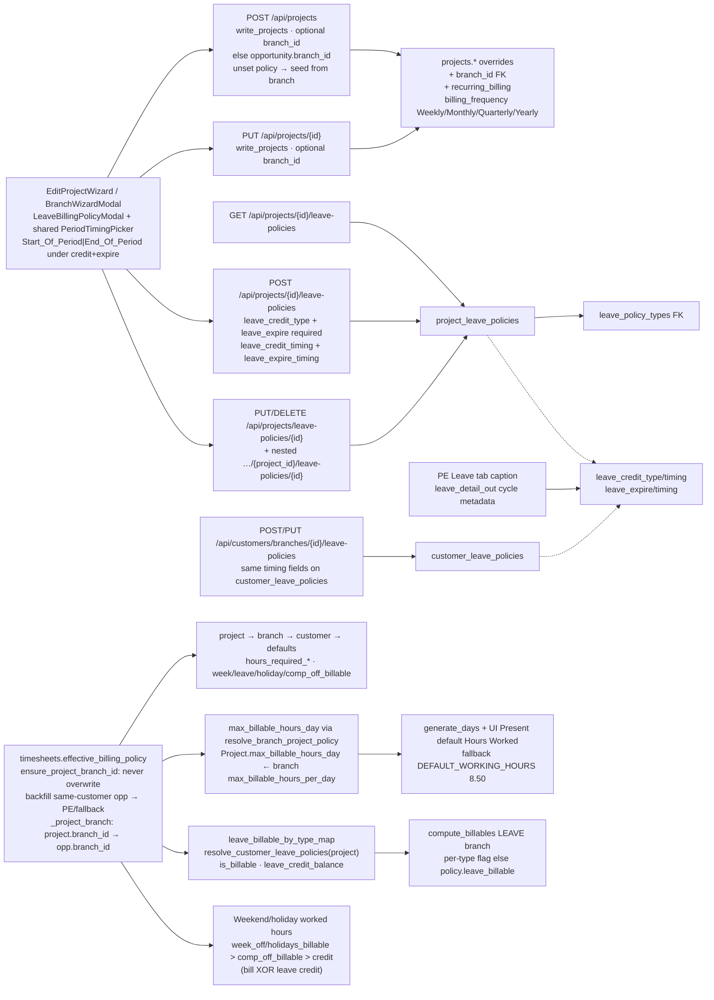

Create wizard steps: Project Details (name/opportunity/customer) → Leave & Holiday Billing Policy (combined holiday thresholds + leave-billing rows; create mode prefills from opportunity branch policy and persists `branch_id`) → Billing Properties. Edit keeps the same 2 policy sections (loads project’s own policy).
## 4.7 Customer Holiday Calendar (branch-year + names master)

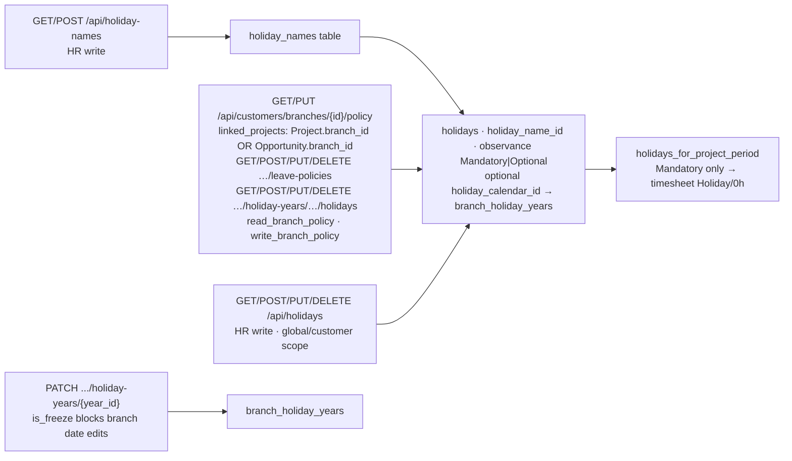
