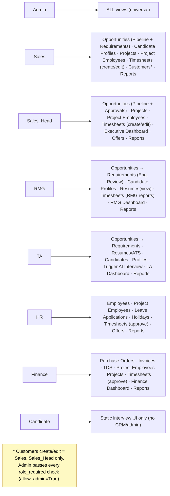
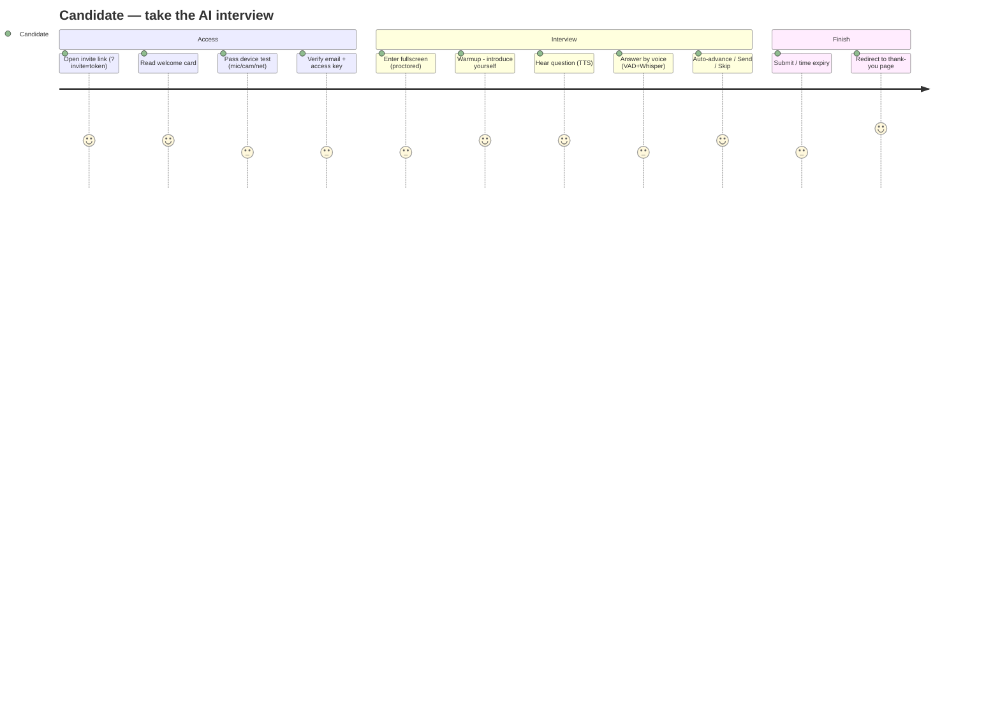
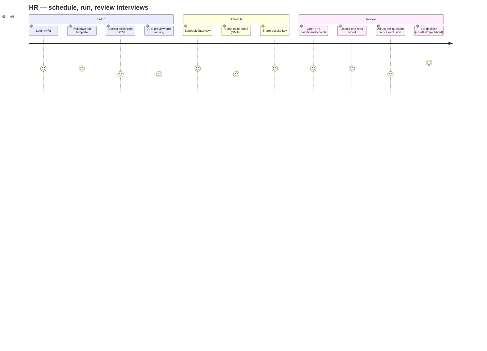
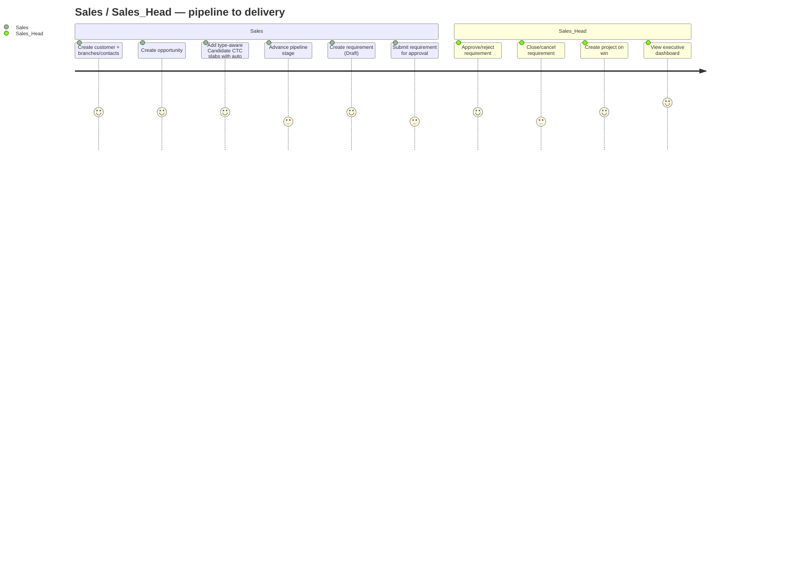
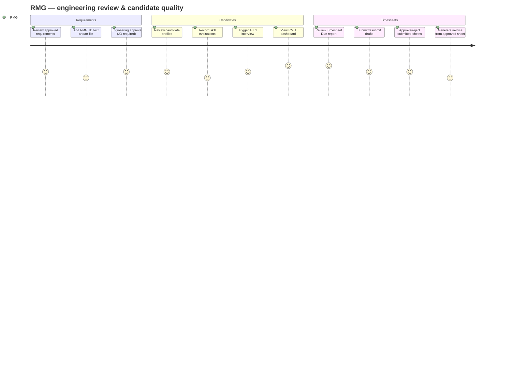
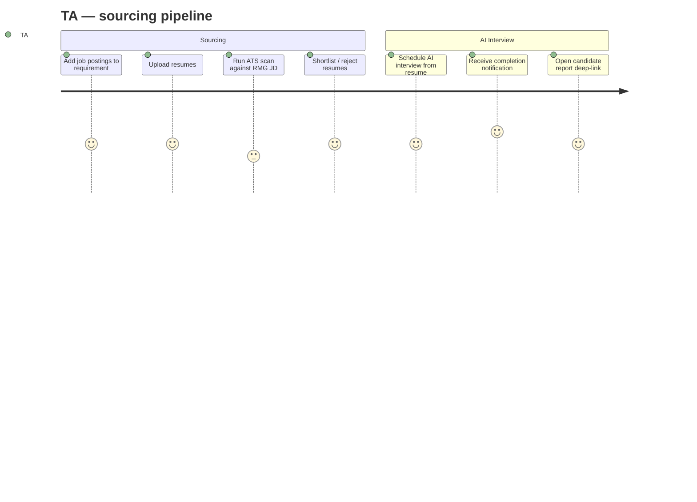
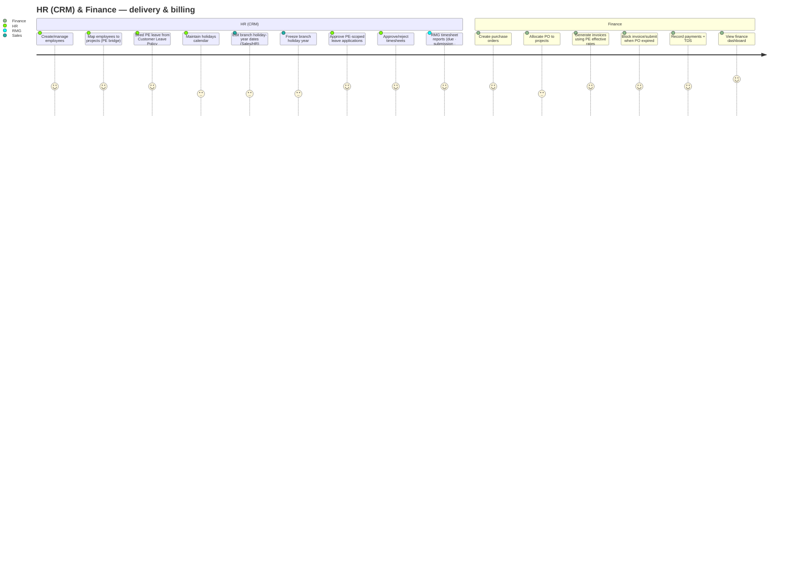
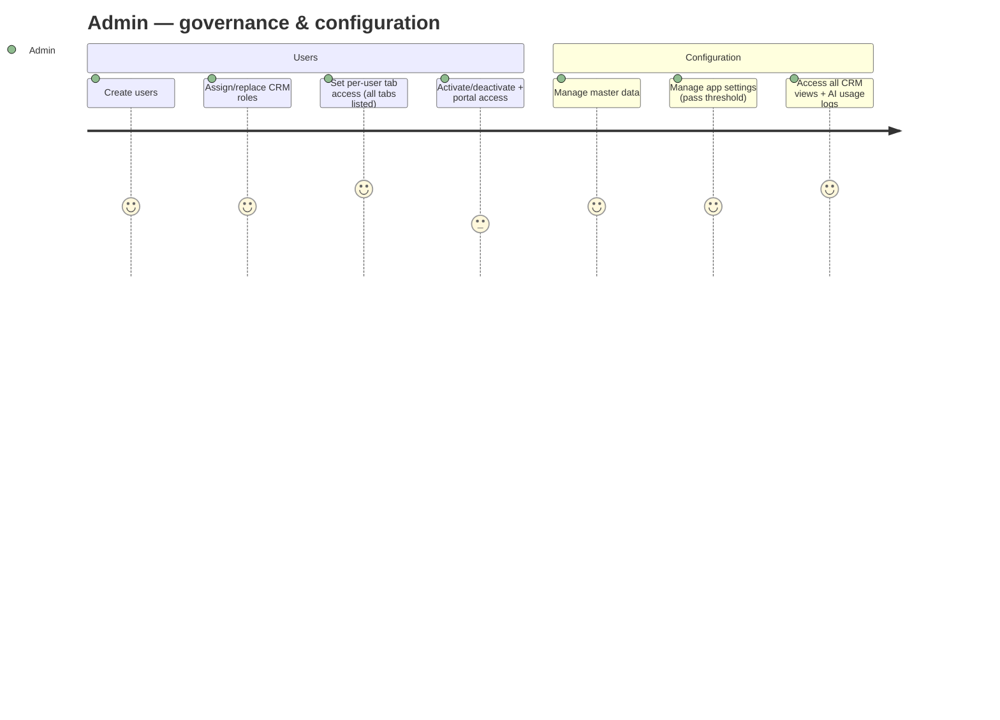
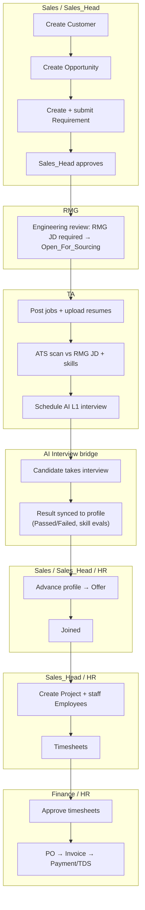

# 5. User Journey Diagrams (per role)

Roles come from two systems:

- **Interview platform** (`registration_data.role`): `candidate`, `hr`.
- **CRM RBAC** (`models/rbac.py::RoleName`): `Admin, CEO, Sales, Sales_Head, RMG, TA, HR, Finance`.

## 5.1 Role → CRM view access matrix

## 5.2 Candidate journey (AI interview)

## 5.3 HR (interview platform) journey

## 5.4 Sales & Sales_Head journey (CRM front office)

## 5.5 RMG journey (engineering review & staffing)

## 5.6 TA journey (sourcing & AI interviews)

## 5.7 HR (CRM) & Finance journeys (back office)

## 5.8 Admin journey (governance)

## 5.9 CRM lifecycle swimlane (cross-role, end to end)

