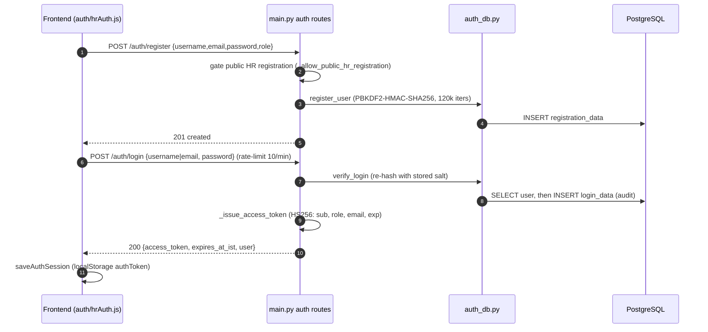
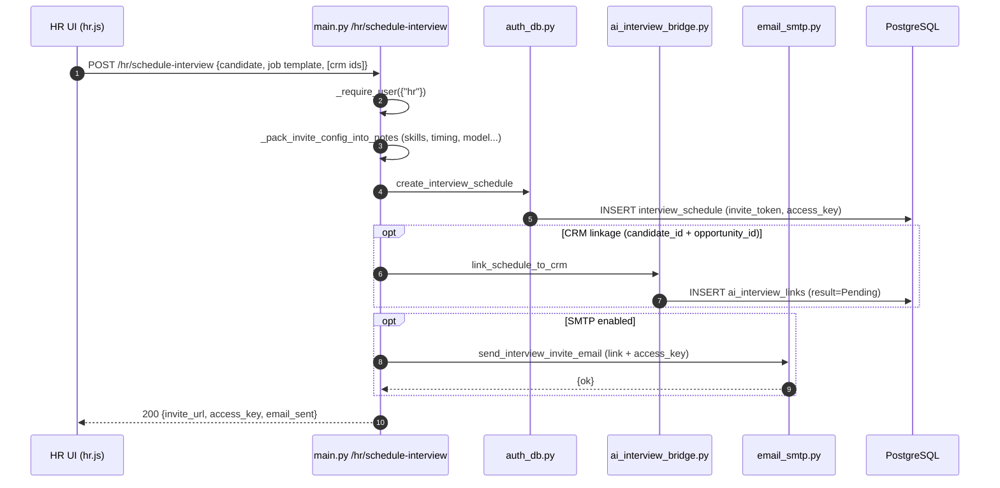
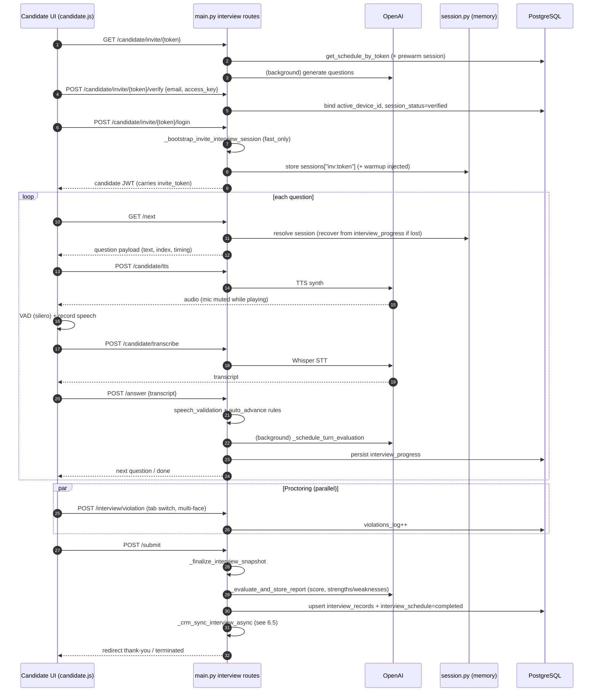
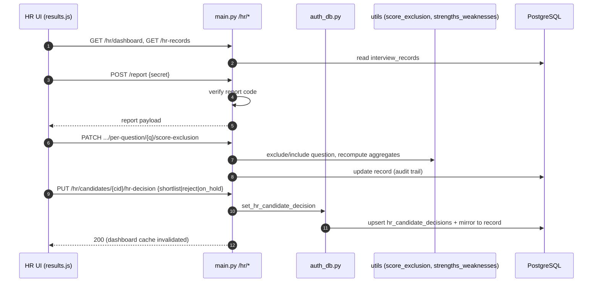
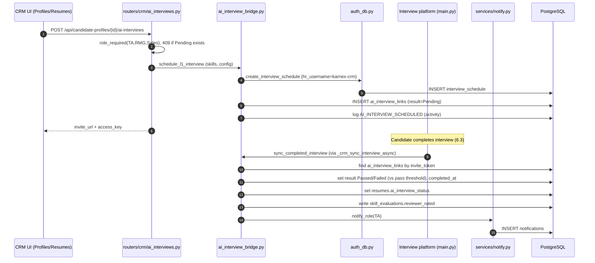
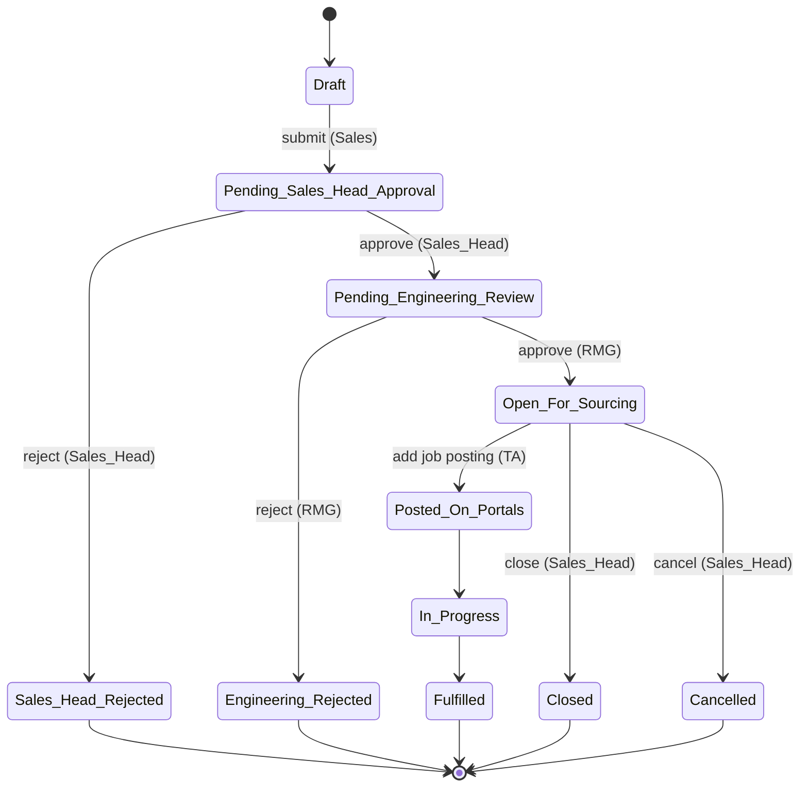
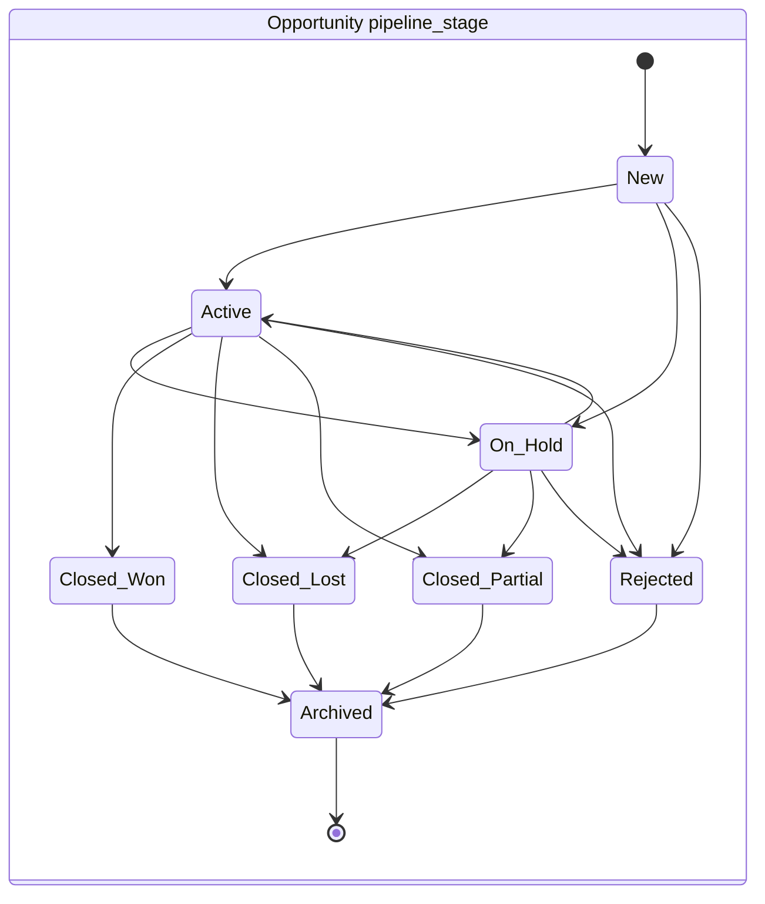
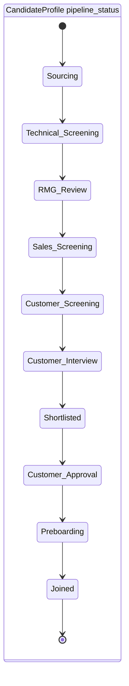
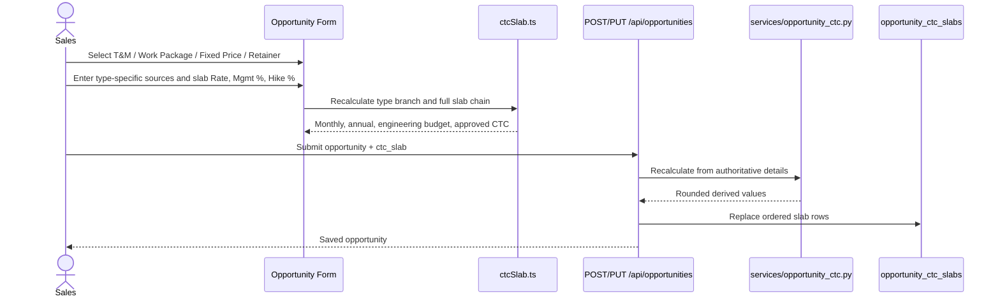

# 6. Sequence Diagrams (key workflows)

## 6.1 Authentication (register + login + JWT)



## 6.2 HR schedules interview + invite email



## 6.3 Candidate interview loop (the core workflow)



## 6.4 HR reviews results & records decision



## 6.5 CRM ↔ Interview bridge (trigger L1 + sync back)



## 6.6 Requirement approval state machine



## 6.7 Opportunity & candidate-profile pipelines





## 6.8 Project Employee bridge (map → leave → invoice)

```mermaid
sequenceDiagram
    actor HR as HR / Sales_Head
    participant API as /api/projects
    participant PE as project_employees
    participant Leave as leave_details
    participant PO as po_project_allocations
    participant TS as timesheets

    HR->>API: POST /{project_id}/employees
    API->>PE: insert / reactivate mapping
    API->>Leave: seed copy from CustomerLeavePolicy
    API->>PE: ensure project_employee_rates (is_current)
    HR->>API: POST /leave-applications (project_id / project_employee_id required when mapped)
    Note over API,Leave: Approve debits PE leave_balance only; Comp-Off bypasses balance gate
    HR->>TS: create/submit timesheet
    Note over TS,PO: Submit never blocked by PO; calendar holidays locked on entries
    HR->>API: generate-invoice from timesheet
    API->>PE: split_period_by_rate times billable
    API->>PO: drawdown consumed_amount (block if 100%/expired)
```

## 6.9 Opportunity-type Candidate CTC Slab save


